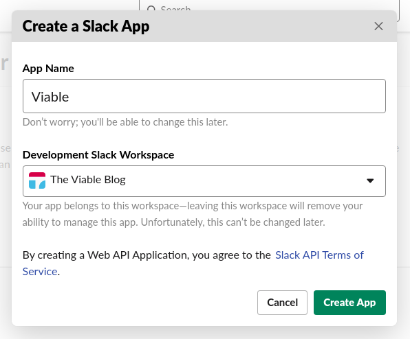

In this post I am going to show how you can trigger a GitHub Action with a Slack Slash command.

# What's a Slack Slash Command?

The popular team communication platform 'Slack' provides several means to extend the platform. 
One of the Slack extension is the so-called Slash Command, which alays starts with a `/`. 

"Slash Commands allow users to invoke your app by typing a string into the message composer box.

A submitted Slash Command will cause a payload of data to be sent from Slack to the associated app. The app can then respond in whatever way it wants using the context provided by that payload.

These commands are the entry points for complex workflows, integrations with external services, or even just simple message responses. They're the knock at your app's front door that could be the start of a great conversation."

# What is a GitHub Action?

Todo

# Create a Slack App
In order to create a Slack Slash Command you must first create a Slack App.  assocated with a https://api.slack.com/apps?new_app=1

The mapping templates for application/x-www-form-urlencoded

{code}
{
    "event_type": "slack-deploy-command", 
    "client_payload":
    {
        "data": {
        #foreach( $token in $input.body.split('&') )
            #set( $keyVal = $token.split('=') )
            #set( $keyValSize = $keyVal.size() )
            #if( $keyValSize >= 1 )
                #set( $key = $util.urlDecode($keyVal[0]) )
                #if( $keyValSize >= 2 )
                    #set( $val = $util.urlDecode($keyVal[1]) )
                #else
                    #set( $val = '' )
                #end
                "$key": "$val"#if($foreach.hasNext),#end
            #end
        #end
        }
    }
}
{code}

Post response 
{code}
{
    "response_type": "in_channel",
    "text": "Your deployment request has been dispatched to pipeline."
}
{/code}
