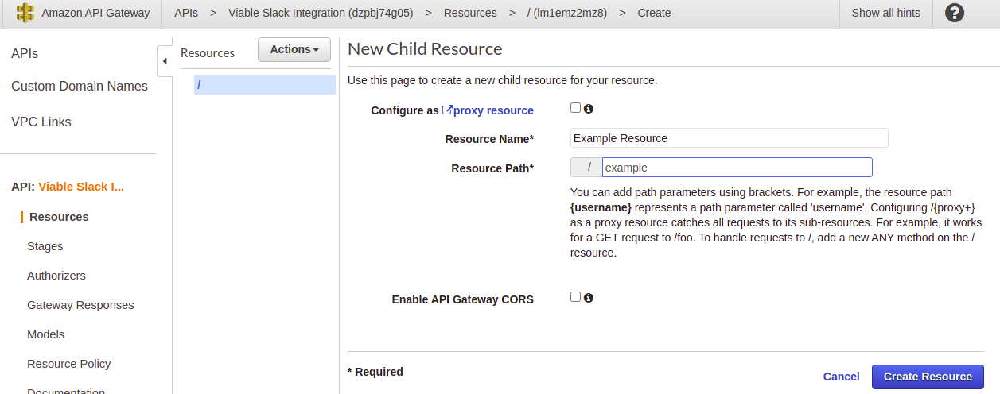

In this post I am going to show how you can trigger a [GitHub Actions](https://github.com/features/actions) workflow with a Slack Slash command.

<!-- more -->

The popular team communication platform 'Slack' provides several means to extend their platform. 
One means of extension is the so-called [Slash Command](https://api.slack.com/interactivity/slash-commands#what_are_commands), 
which as the name suggest starts with a forward slash. When a Slash Command is invoked, Slack will call the associated Slack 
App's webhook. This means you can integrate with any external service, including invoking your own GitHub Actions Workflow.

The very popular Git code hosting platform 'GitHub' has recently added the 'GitHub Actions' capability. GitHub Actions 
makes it easy to automate all your software workflows [^1].

The payload send from the Slack Slash command is not understood by GitHub's own API directly. However, with the help of 
the [AWS API Gateway](https://aws.amazon.com/api-gateway/) it's possible to integrate a Slack Slash Command with a 
GitHub repository dispatch event.

# The GitHub Actions Workflow
For the sake of this post, the GitHub Actions Workflow is kept simple. By keeping it simple we can keep validating 
our configurations.

If you would like to follow along, you can fork my [Actions Experiments](https://github.com/GeoffHayward/actions-experiments/) repository.

```yaml
name: Configuration Check
on:
  repository_dispatch:
    types:
      - configuration-check
jobs:
  check:
    name: Run check
    runs-on: ubuntu-latest
    steps:
      - name: Say hello
        run: echo Hello
```
As you can see from my example, GitHub Actions Workflow's that are triggered externally via GitHub's API listens for [repository dispatch events](https://docs.github.com/en/rest/reference/repos#create-a-repository-dispatch-event).

In order to trigger GitHub Actions Workflow, on a repository you have access to, you must first obtain a **repo** scoped [Personal Access Token](https://docs.github.com/en/github/authenticating-to-github/creating-a-personal-access-token)
from this URL https://github.com/settings/tokens. 


With the token to hand, the GitHub Actions Workflow can be triggered from the terminal with the following curl command with
`{owner}` replaced respectively.

```shell
curl \
  -X POST \
  -H "Accept: application/vnd.github.v3+json" \
  -H "Authorization: Bearer ********* PERSONAL ACCESS TOKEN *********" \
  https://api.github.com/repos/{owner}/actions-experiments/dispatches \
  -d '{"event_type":"configuration-check"}'
```
The curl command should return with an empty body. You can check if it worked within the GitHub repository's actions tab.
The run should look like this. 


# The AWS API Gateway Instance
Once the triggering of the Actions Workflow is verified, it's time to add the [AWS API Gateway](https://aws.amazon.com/api-gateway/) into the mix.
The AWS API Gateway will allow for the transforming of the payload, soon to be, sent by Slack into a payload understood by GitHub.

We begin by creating a new AWS API Gateway of type REST API.


Once created, add a resource named 'example'. 



Give the resource a method of type POST. Choose the Integration Type as an HTTP integration. This allows you to call out 
to non AWS services, such as the GitHub API. Set the Endpoint URL will be `https://api.github.com/repos/{owner}/actions-experiments/dispatches` replacing owner respectively.


At this point, with the example POST method selected, you should see a method execution view to look akin to this


At this point you should see 

Let's test again. Let's check we can trigger our GitHub Actions Workflow from AWS.


The mapping templates for application/x-www-form-urlencoded

```text
{
    "event_type": "slack-deploy-command", 
    "client_payload":
    {
        "data": {
        #foreach( $token in $input.body.split('&') )
            #set( $keyVal = $token.split('=') )
            #set( $keyValSize = $keyVal.size() )
            #if( $keyValSize >= 1 )
                #set( $key = $util.urlDecode($keyVal[0]) )
                #if( $keyValSize >= 2 )
                    #set( $val = $util.urlDecode($keyVal[1]) )
                #else
                    #set( $val = '' )
                #end
                "$key": "$val"#if($foreach.hasNext),#end
            #end
        #end
        }
    }
}
```


Post response 
```json
{
    "response_type": "in_channel",
    "text": "Your deployment request has been dispatched to pipeline."
}
```

It's a good idea to set up AWS CloudWatch at this point, but not essential. CloudWatch will let you see what Slack is 
sending in. If you a would like to set up CloudWhat here is the [documentation](https://aws.amazon.com/premiumsupport/knowledge-center/api-gateway-cloudwatch-logs/).

# Create a Slack Slash Command
In order to create a Slack Slash Command you first [create a Slack App](https://api.slack.com/apps?new_app=1).


After creating a Slack App, [create a Slash Command](https://api.slack.com/apps/A01KM6562KY/slash-commands).


[^1]: https://github.com/features/actions